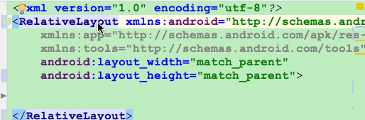

# Android-Studio-Plugin
Android Studio上一些实用的插件 - 不定期更新

### __1.GsonOrXmlFormat | GsonFormat__
插件地址 - [https://plugins.jetbrains.com/plugin/8435-gsonorxmlformat](https://plugins.jetbrains.com/plugin/8435-gsonorxmlformat)  

Github - [https://github.com/zzz40500/GsonFormat](https://github.com/zzz40500/GsonFormat)  
插件地址 - [https://plugins.jetbrains.com/plugin/7654-gsonformat](https://plugins.jetbrains.com/plugin/7654-gsonformat)  
直接把Json给你生成对应的Model  

### __2.Android ButterKnife Zelezny__
Github - [https://github.com/avast/android-butterknife-zelezny](https://github.com/avast/android-butterknife-zelezny)  
插件地址 - [https://plugins.jetbrains.com/plugin/7369-android-butterknife-zelezny](https://plugins.jetbrains.com/plugin/7369-android-butterknife-zelezny)  
选中布局，一键生成ButterKnife的代码  

### __3.Android File Grouping__
Github - [https://github.com/dmytrodanylyk/folding-plugin](https://github.com/dmytrodanylyk/folding-plugin)  
插件地址 - [https://plugins.jetbrains.com/plugin/7876-android-file-grouping](https://plugins.jetbrains.com/plugin/7876-android-file-grouping)  
可以把你工程里的文件分类，只是显示的时候分类显示，不会创建文件夹  

### __4.Android Parcelable code generator__
Github - [https://github.com/mcharmas/android-parcelable-intellij-plugin](https://github.com/mcharmas/android-parcelable-intellij-plugin)  
插件地址 - [https://plugins.jetbrains.com/plugin/7332-android-parcelable-code-generator](https://plugins.jetbrains.com/plugin/7332-android-parcelable-code-generator)  
一键生成Parcelable的代码  

### __5.Android Selectors Generate__
Github - [https://github.com/inmite/android-selector-chapek](https://github.com/inmite/android-selector-chapek)  
插件地址 - [https://plugins.jetbrains.com/plugin/7682-android-selectors-generate](https://plugins.jetbrains.com/plugin/7682-android-selectors-generate)  
只要图片命名与状态对应，就能一键生成selector.xml，更详细的介绍可以去插件的Github    

### __6.ECTranslation__
Github - [https://github.com/Skykai521/ECTranslation](https://github.com/Skykai521/ECTranslation)  
插件地址 - [https://plugins.jetbrains.com/plugin/8469-ectranslation](https://plugins.jetbrains.com/plugin/8469-ectranslation)  
可以在Android Studio里使用划词翻译，可以自定义快捷键

### __7.Databinding Support__
Github - [https://github.com/shiraji/databinding-support](https://github.com/shiraji/databinding-support)  
插件地址 - [https://plugins.jetbrains.com/plugin/9271-databinding-support](https://plugins.jetbrains.com/plugin/9271-databinding-support)  
将普通布局一键转换DataBinding布局，还有更多用法可以去插件的Github

## __插件安装__
`Preferences` - `Plugins` - `Browse repositories...`- `Install`  

