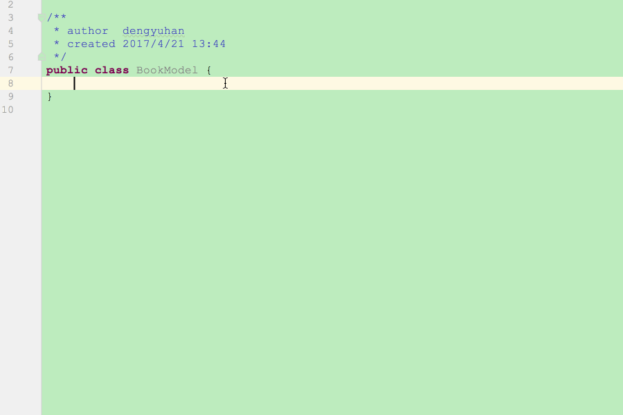
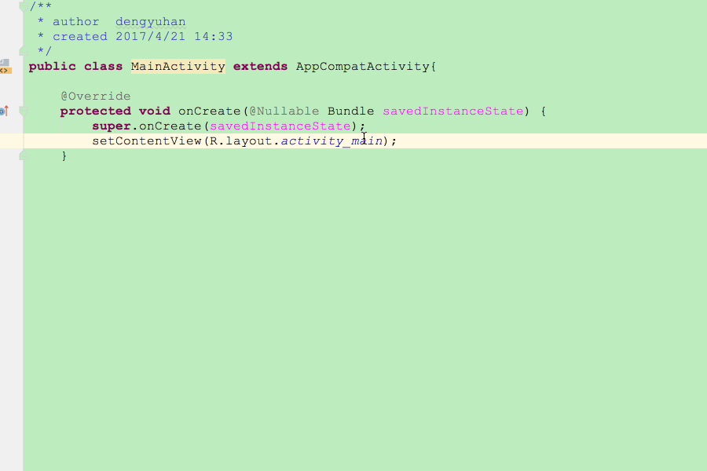
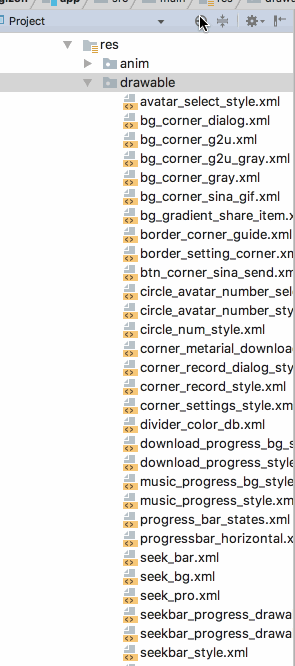
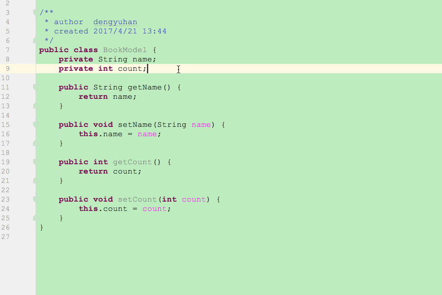
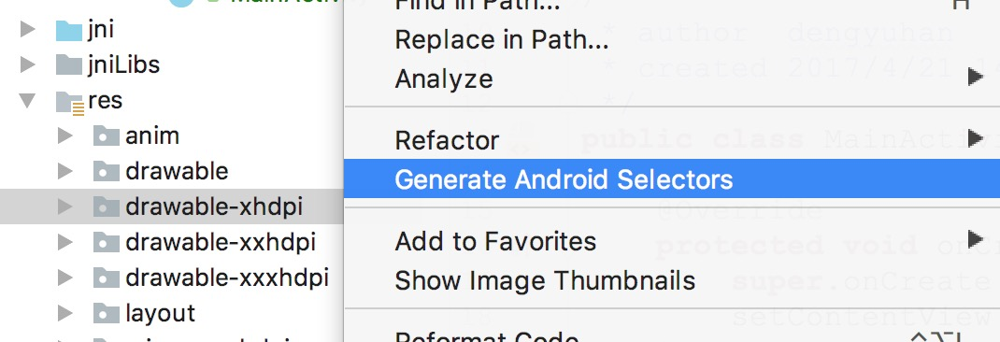
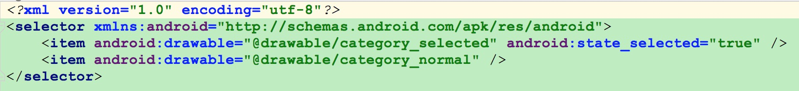
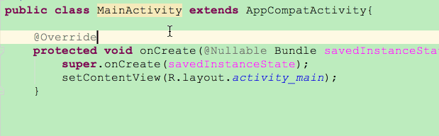
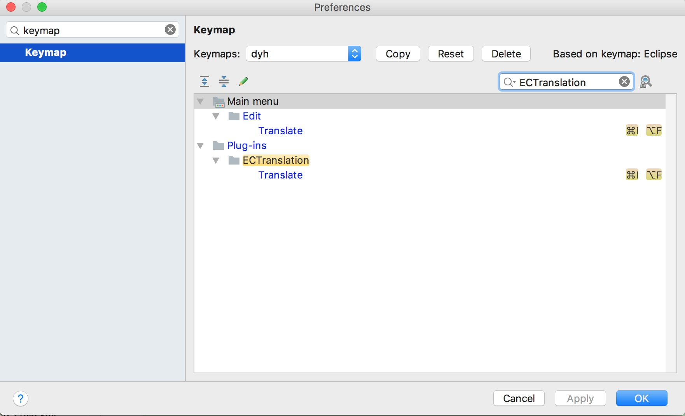
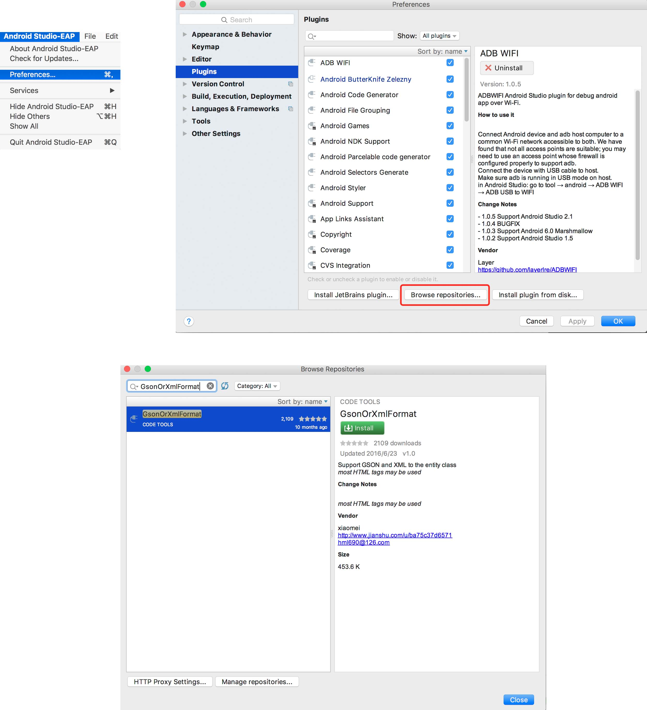

# Android-Studio-Plugin
Android Studio上一些实用的插件

### __1.GsonOrXmlFormat__
Github - [https://github.com/zzz40500/GsonFormat](https://github.com/zzz40500/GsonFormat)  
直接把Json给你生成对应的Model  

### __2.Android ButterKnife Zelezny__
Github - [https://github.com/avast/android-butterknife-zelezny](https://github.com/avast/android-butterknife-zelezny)  
选中布局，一键生成ButterKnife的代码  

### __3.Android File Grouping__
Github - [https://github.com/dmytrodanylyk/folding-plugin](https://github.com/dmytrodanylyk/folding-plugin)  
可以把你工程里的文件分类，只是显示的时候分类显示，不会创建文件夹  

### __4.Android Parcelable code generator__
一键生成Parcelable的代码  

### __5.Android Selectors Generate__
只要图片命名与状态对应，就能一键生成selector.xml，更详细的介绍可以去Github  
Github - [https://github.com/inmite/android-selector-chapek](https://github.com/inmite/android-selector-chapek)  

### __6.ECTranslation__
可以在Android Studio里使用划词翻译，可以自定义快捷键  
Github - [https://github.com/Skykai521/ECTranslation](https://github.com/Skykai521/ECTranslation)  

## __插件安装__
`Preferences` - `Plugins` - `Browse repositories...`- `Install`  

